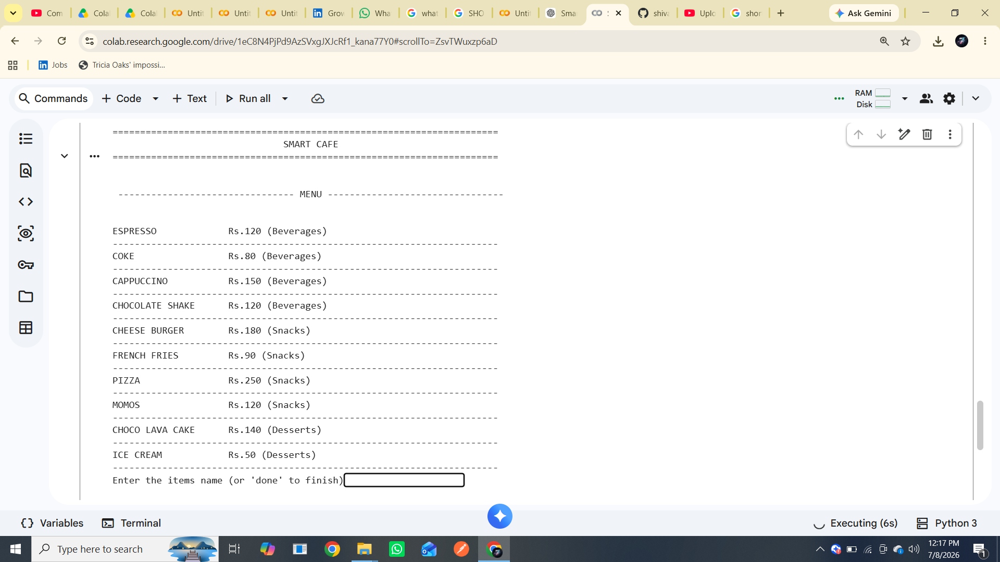
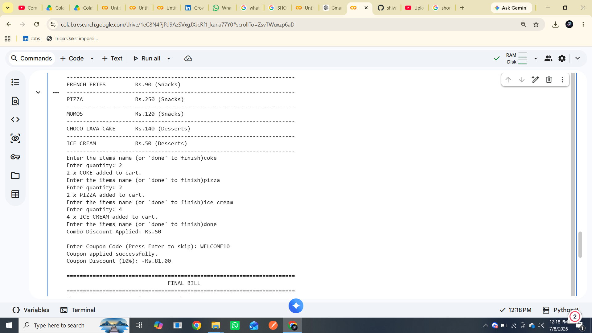
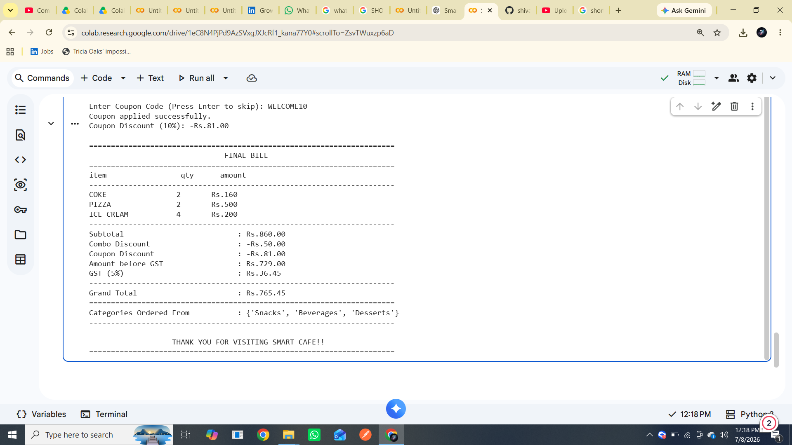

# ☕ Smart Cafe Digi-Menu & Auto-Billing Engine

## Description

This is a terminal-based Cafe Ordering and Automated Billing System developed using Python.

It allows customers to:

- View the digital menu
- Order multiple food items
- Enter quantities
- Get automatic billing
- Receive combo discounts
- Apply coupon codes
- Calculate GST automatically

---

## Features

- Nested Dictionary
- List
- Set
- While Loop
- For Loop
- Functions
- Combo Discount
- Coupon System
- GST Calculation
- Automated Receipt

---

## Technologies Used

- Python

---

## How to Run

Run:

```bash
python smart_cafe_billing.py
```

---

## Project Output

### Menu Display


### Order Process


### Final Bill


## Author

Shivam
